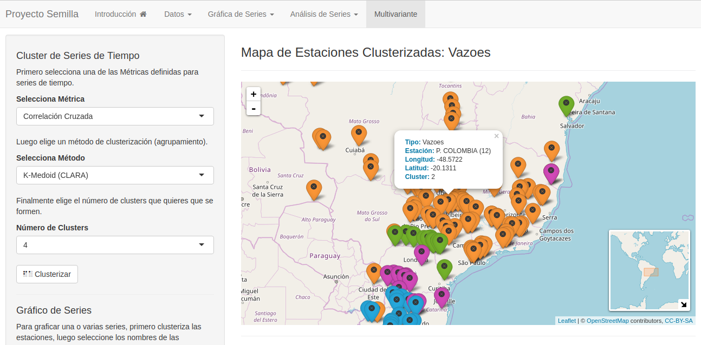
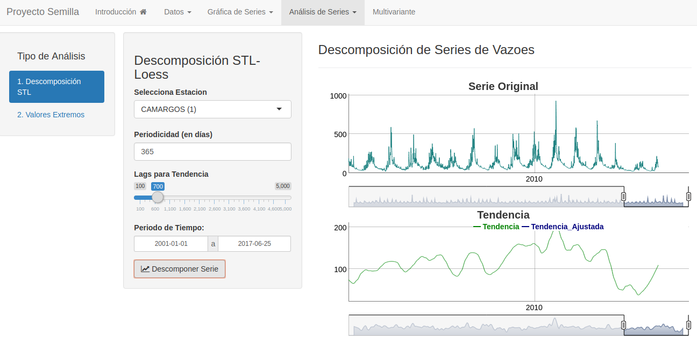
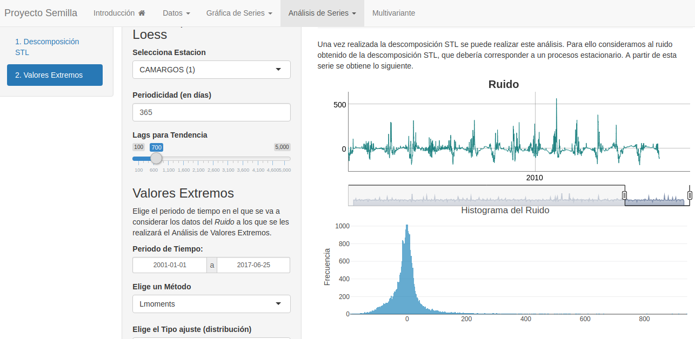

# Proyecto de Investigación

 

#### Forecast and Impact of extreme low levels of streamflow in hydropower plants.

#### Director: PhD. Adriana Uquillas

#### Assistant: Cristian Pachacama

## Abstract

The development of a methodology to valuate hydrologic critical situations is critical given that the availability of water, profoundly affects the service conditions of the consumer energy market, mainly in the countries where the predominance energy sector is hydraulic.
In this project, we will propose a new approach for modeling extreme low levels of streamflow in hydropower plants. The Brazilian electricity system has the peculiarity that most of its energy is generated using renewable sources, mainly by hydroelectric plants (as also in Ecuador). Moreover, due to the continental dimensions of Brazil and the influences of many different climatological patterns, there is the possibility to develop a deep search in operation planning of hydroelectric plants. For this reason, it provides a representative sample of the difficulties for operating a predominantly renewable basis energy matrix. To deal with that kind of problems of Brazilian case we have the support of PhD Ildo Sauer, research professor of the Sao Paulo University, who is an expert in energy planning, demand models, resources and energy supply, regulation, control and energy policies. In this project, we will benefit of him experience in order to replicate these studies to the Ecuadorian case in next researches.
In the theoretical aspect, the modeling of future inflows will be made via Extreme Value Theory, because in the situation of climate changes the deviation of the mean-variance models increase significantly, resulting in periods with risk of deeper droughts. This, may, eventually, lead to situations in which the supply capacity is less than the demand, leading even rationing (Brazil had a rationing in 2002). It is then clear that the ability to accurately predict extreme low levels of flow rates and to make early warnings of these events is an important tool for the operation of the electric sectors with predominance of hydraulic energy.
There are evidences that exist a causal relationship between the streamflow and the large-scale phenomena such as El Niño where the climate information is incorporated in a systematic way for decision making in water resources. However, this evidences and techniques used in its analysis do not consider extreme events caused by critical climate changes that are the objective of this study, where we propose the study of extreme low water levels in hydropower plants incorporating temporal, spatial and weather couplings that directly affect the operational planning.

## Shiny APP

This application was designed for the analysis of time series associated with flow, climate, and contamination data (with more than 30 years of daily information). The STL-Loes decomposition of the time series is included, as well as Extreme Value Analysis and Cluster Analysis of time series.

